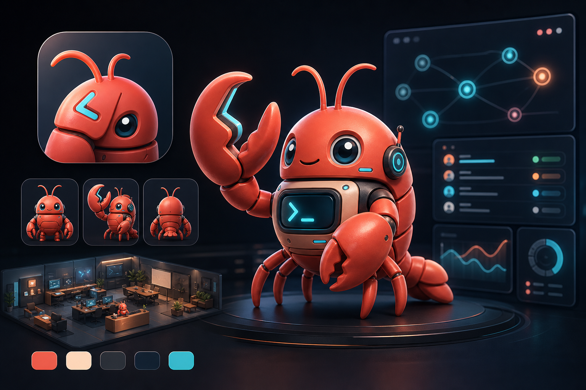
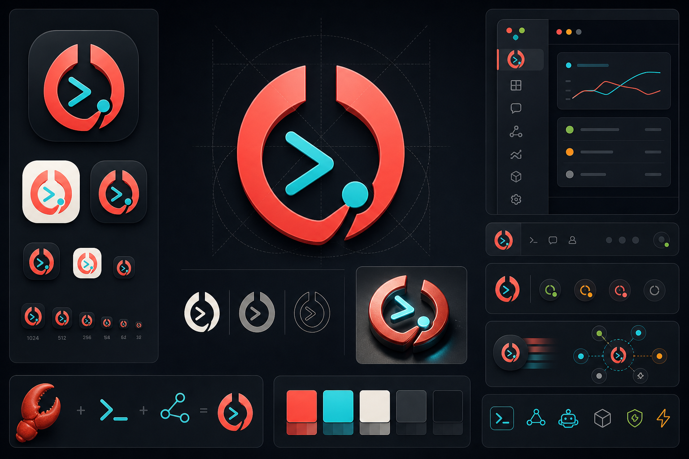
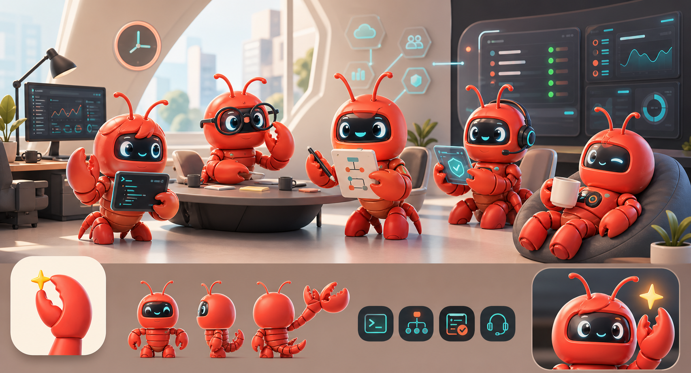
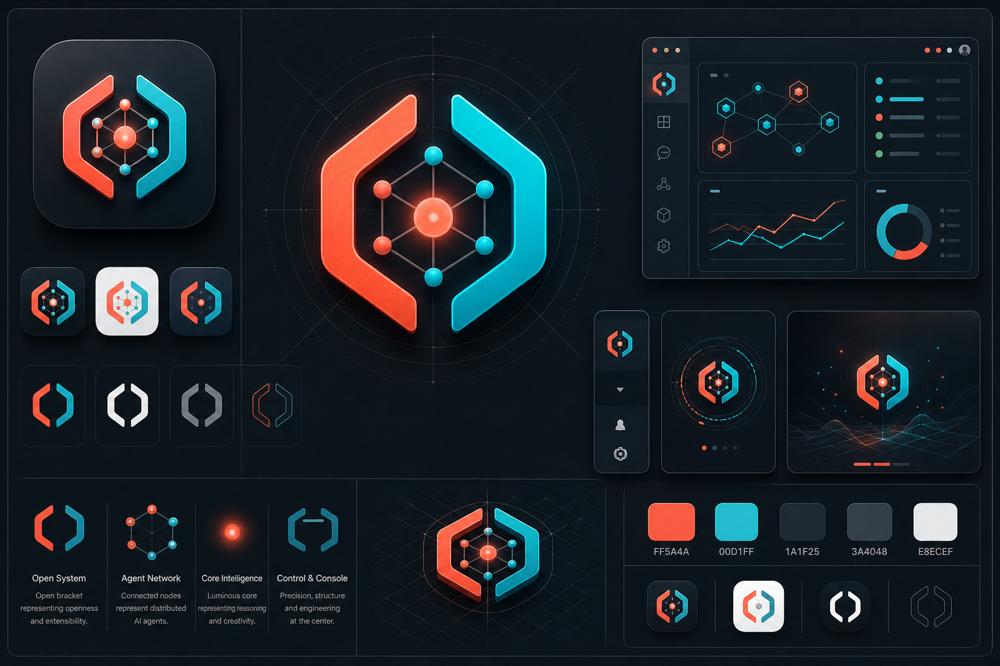
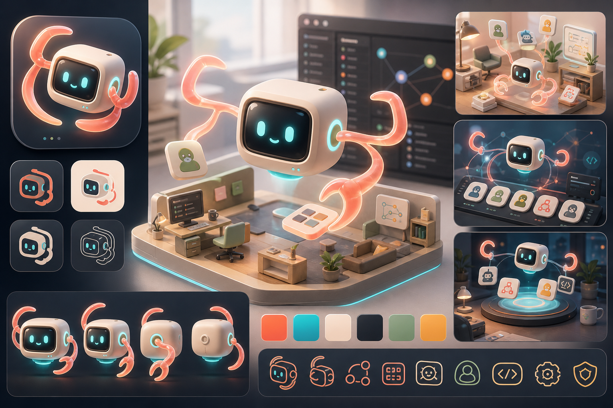
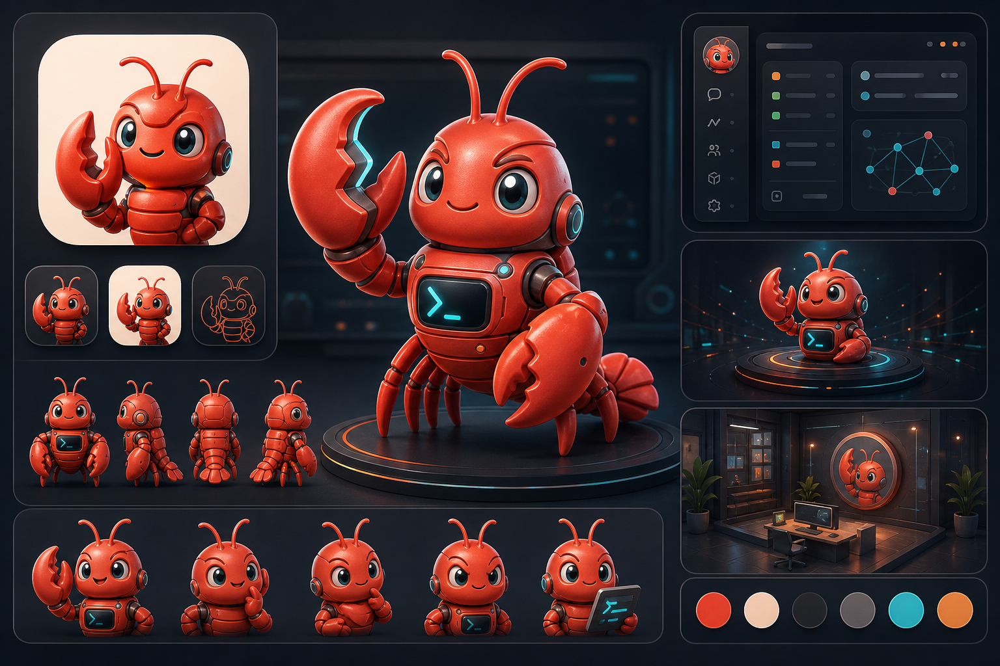

# OpenClaw 品牌形象探索

> 日期: 2026-06-25  
> 状态: 方向确认  
> 目的: 记录 OpenClaw Desktop 品牌形象方向、效果图和取舍，供后续继续迭代。

## 方向决策

确认采用 **方案 D: Crayfish Operator** 作为 OpenClaw Desktop 品牌主方向。

核心判断:

- OpenClaw 不能完全去吉祥物化。
- 吉祥物必须保留“小龙虾的灵魂”。
- 角色不能只是可爱 IP，而应成为 AI Agent 控制台里的操作员、调度员和工作伙伴。
- 系统符号可以辅助品牌专业度，但不能替代小龙虾主角。

后续 App Icon、启动页、官网主视觉、3D Office 前台形象和 Agent Teams 角色扩展，都应优先从方案 D 派生。

## 背景

OpenClaw Desktop 是面向 AI Agent 时代的桌面控制台，连接 OpenClaw Gateway，管理会话、工作流、Agent Teams 和 3D 虚拟办公室。品牌需要同时表达:

- AI Agent 操作系统 / 控制台的可靠感。
- 多 Agent 团队和虚拟办公室的生命力。
- 桌面产品应有的图标识别度和小尺寸可读性。

用户提供的参考强调了红色钳形角色、3D 吉祥物、团队角色和明亮亲和感。当前探索不能只复制“可爱钳子角色”，还要服务 OpenClaw 自身的产品定位。

## 方案 A: Command Claw 体系

> 备注: 这是第一轮输出。经复盘，它不是三套独立方案，而是一套品牌体系的三个应用场景。保留为备选。

### 思路

保留现有红色钳形角色资产的记忆点，把它从“圆萌吉祥物”升级成“AI 控制台主角”。核心元素是红珊瑚色钳子、终端胸屏、cyan 状态光、深色控制台背景。

### 效果图

### 适合场景

- App Icon、启动页、官网 hero。
- 3D Office 前台品牌墙。
- Agent Teams / onboarding / 空状态插画。

### 优点

- 与现有资产迁移成本低。
- 红色钳形角色有记忆点。
- 能自然承接 3D Office 和 Agent Teams。

### 风险

- 如果比例和材质控制不好，会继续显得幼态。
- 专业控制台感需要靠符号系统和 UI 语境补足。
- 与用户参考图过近时，差异化不足。

## 方案 B: System Symbol

### 思路

完全弱化动物和吉祥物，把 OpenClaw 做成一个系统级符号: open bracket、发光核心、Agent 节点网络。重点是桌面工具、工程控制台、AI 操作系统，而不是角色 IP。

### 效果图

### 适合场景

- 主 Logo、托盘图标、favicon、小尺寸 sidebar badge。
- 深色模式控制台、加载动画、系统状态页。
- 面向企业和工程用户的官网首屏。

### 优点

- 小尺寸可读性和专业度最好。
- 不依赖吉祥物，可长期稳定。
- 更贴近“AI Agent Operating System”的定位。

### 风险

- 情绪记忆点弱于角色方案。
- 需要搭配动效、插画或副形象，否则品牌温度不足。
- 如果符号太抽象，用户不容易把它和 “Claw” 建立联系。

## 方案 C: Digital Workshop Companion

### 思路

跳出钳形动物，把品牌主角改成“数字工坊伴侣”: 一个漂浮的工作台核心 / AI 设备，用光带和 Agent tiles 表达编排、调度、协作。它仍能保留少量 open-claw 手势，但不把钳子作为物种。

### 效果图

### 适合场景

- onboarding、空状态、任务编排、Agent 协作解释图。
- 3D Office 的前台 / 控制核心 / 调度台。
- 官网中段的能力说明和产品故事。

### 优点

- 与参考图差异最大，不会像“又一个红色钳子吉祥物”。
- 更容易表达 Agent 编排和虚拟办公室。
- 既有温度，也保留生产力工具气质。

### 风险

- 名字 OpenClaw 与视觉主角的直接关联变弱。
- App Icon 需要进一步抽象，否则小尺寸可能不够强。
- 需要重新建立一套角色语言，迁移成本高于方案 A。

## 方案 D: Crayfish Operator

### 思路

基于用户反馈重新收敛: 不能完全去吉祥物化，且吉祥物必须保留“小龙虾的灵魂”。这个方向不再试图摆脱小龙虾，而是把小龙虾升级为 OpenClaw 的 AI 控制台操作员。

它需要保留:

- 小龙虾触须、分节甲壳、红色钳子和紧凑身体。
- 亲近、聪明、愿意帮忙的表情。
- 与 OpenClaw 强相关的终端屏、状态灯、Agent 节点、控制台环境。

它需要避免:

- 过度幼态的大头娃娃比例。
- 只像儿童玩具或食品 IP。
- 完全抽象化导致失去 OpenClaw 名字里的 Claw 记忆点。

### 效果图

### 适合场景

- 新 App Icon 和启动页主视觉。
- 3D Office 前台接待 / 系统操作员。
- Agent Teams 的主品牌角色。
- 官网 hero 和介绍 OpenClaw 的第一眼视觉。

### 优点

- 最符合“小龙虾灵魂”要求。
- 兼顾现有资产延续和更专业的控制台气质。
- 能自然连接 OpenClaw 的名称、3D Office 和多 Agent 团队。

### 风险

- 需要严格控制角色比例，否则容易回到方案 A 的幼态问题。
- 小尺寸图标仍需要配套的抽象钳形符号。
- 如果只做单角色，会弱化 Agent Teams 的群体感，后续需要角色家族扩展。

## 当前建议

用户进一步明确: 品牌不能完全去吉祥物化，吉祥物仍然要保留“小龙虾的灵魂”。因此方案 B 不适合作为最终完整品牌方向，只适合作为 Logo / 图标 / 系统符号层。OpenClaw 的主轴应调整为:

> 小龙虾是灵魂，系统符号是骨架。

也就是保留红色钳形、小龙虾轮廓、触须、甲壳分节和亲近感，同时降低幼态比例，把它塑造成 AI 控制台里的工作伙伴、调度员或系统守护者。

短期不应急着替换所有品牌资产。推荐下一步只做一轮更聚焦的方向验证:

1. 以方案 B 做一个可落地矢量主标。
2. 围绕“小龙虾灵魂”继续派生主吉祥物，测试更成熟的角色比例、材质和表情。
3. 把同一方向分别放进 App Icon、sidebar badge、启动页、3D Office 前台墙四个真实场景里比较，而不是只看单张概念图。

当前优先级调整为: 方案 D 作为主线；方案 B 作为符号系统辅助；方案 A 作为历史备选和可迁移资产参考；方案 C 暂时降级为远期世界观参考，不作为主线。
