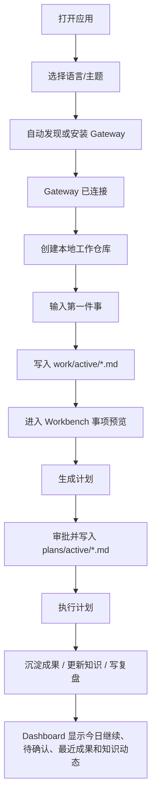

# 开箱金线独立推进设计与实施文档

> 状态：活跃
> 优先级：P0
> 适用线程：可由新的 Codex 会话并行推进
> 关联路线图：`docs/design-docs/product-goal-roadmap.md` 的 P0-0 与 P0-6

## 1. 目标

开箱金线的目标不是“连接 Gateway 成功”，而是让普通用户第一次打开 Desktop 时，直接进入一个可长期成长的本地 AI 工作系统。

核心判断：

- Gateway 是基础设施，不是用户目标。
- Repository 是长期事实源，不是隐藏实现细节。
- Workbench 是用户第一件事的承接面，不是高级用户才会发现的二级页面。
- 开箱金线必须把用户从“我连上了一个 AI 后端”带到“我已经创建了工作系统，并且有一件事可以继续推进”。

用户确认的金线必须原样作为验收口径：

```text
打开应用 -> 选择语言/主题 -> 自动发现或安装 Gateway -> 创建本地工作仓库 -> 输入第一件事 -> 进入工作台
```

这条线是 P0。它不以产物系统为主线，也不应该因为当前产物线推进较多而被推迟或降级。产物、知识、复盘都是金线后半段的承接能力，但开箱专题的第一目标是让普通用户自然进入“我的工作系统”。

## 2. 为什么单独拎出来

当前仓库里产物、HTML、Artifact 写入、卡片协议等方向推进较快，但开箱金线承担的是另一类关键风险：

- 用户第一眼看到的是不是自己的目标。
- 用户是否能在不知道 Repository、runs、schemas、protocol 的情况下开始工作。
- 用户是否能从第一句话自然落到事项、计划、执行和复盘。
- Desktop 是否真的把 Gateway 降级为基础设施，而不是仍然像控制台。

因此本专题需要独立设计、独立实现、独立验收。并行线程推进时，不能只做视觉欢迎页，也不能只改文案；必须把“连接后创建工作系统”和“第一件事进入工作台”做成可验证路径。

## 3. 当前代码事实

以下是截至 2026-06-29 的当前代码事实，新会话必须以这些为准，不要重复实现已经存在的第一片。

### 3.1 路由与连接后入口

- `src/lib/work-system-onboarding.ts` 定义 `WORK_SYSTEM_ONBOARDING_ROUTE = '/?onboarding=work-system'`。
- `WORK_SYSTEM_ONBOARDING_ANCHOR = 'work-system-onboarding'` 是 Dashboard 定位锚点。
- `isWorkSystemOnboardingSearch()` 用于判断当前 URL 是否处于工作系统开箱入口。
- `src/pages/WelcomePage.tsx` 连接成功后导航到 `WORK_SYSTEM_ONBOARDING_ROUTE`。
- `src/pages/SetupPage.tsx` 连接成功后同样导航到 `WORK_SYSTEM_ONBOARDING_ROUTE`。
- `src/App.tsx` 会识别 `onboarding=work-system`，绕过用户默认首页偏好，让开箱请求进入 Dashboard。

相关测试：

- `src/__tests__/work-system-onboarding.test.ts`

### 3.2 Dashboard 开箱引导

- `src/pages/DashboardPage.tsx` 会识别 `onboardingRequested`。
- 当 Gateway 已连接但当前实例没有可用工作仓库时，Dashboard 会前置显示“创建你的工作系统”路径。
- 该引导把 Gateway 连接标为已完成，把创建本地工作仓库列为下一步。
- Repository 创建复用 `RepositoryGate area="workbench"`，不是单独发明一套仓库绑定流程。
- Dashboard 会滚动到 `work-system-onboarding` 锚点，让连接成功后的用户直接看到工作系统入口。

相关测试：

- `src/__tests__/dashboard-redesign.test.ts`
- `src/__tests__/work-system-onboarding.test.ts`

### 3.3 第一件事写入

- `src/lib/workbench-first-matter.ts` 提供 `buildFirstWorkbenchMatter()` 和 `createFirstWorkbenchMatter()`。
- 用户在 Dashboard 输入第一件事后，Desktop 会写入 `work/active/YYYY-MM-DD-HHmmss-*.md`。
- 事项包含唯一 ID、`status: active`、`source: desktop-onboarding`、目标、验收标准、关联资料、关联计划、执行记录、关联成果和复盘占位。
- 同一天同名事项不会覆盖，因为路径含时间戳。
- 写入要求当前绑定 Repository 的安全写入 API 可用。

相关测试：

- `src/__tests__/workbench-first-matter.test.ts`
- `src/__tests__/repository-workbench.test.ts`

### 3.4 进入 Workbench

- 第一件事写入成功后，Dashboard 会打开 `/workbench?view=tasks&workItemPath=<matter>`。
- `src/pages/WorkbenchPage.tsx` 会读取 `workItemPath` 查询参数。
- `src/components/WorkbenchRepositoryPanel.tsx` 通过 `initialWorkItemPath` 打开对应事项预览。
- Workbench 只接受 `work/(active|completed|someday)/*.md` 范围内的事项路径。
- 用户到达 Workbench 后能看到“生成计划 / 生成成果”入口。

相关测试：

- `src/__tests__/work-system-onboarding.test.ts`
- `src/__tests__/repository-workbench.test.ts`

### 3.5 后半段已有能力

这些能力已经存在，但还没有被包装成一条足够自然的开箱连续体验：

- 工作事项可以发起 `work_matter_plan` ActionRun。
- 计划审批后可写入 `plans/active/` 并回链事项。
- 活跃计划可以发起 `plan_execute` ActionRun。
- ActionRun 详情可通过 `/actions?runId=<run>` 定位。
- 计划执行结果可进入成果沉淀、知识更新和复盘草稿入口。
- Dashboard 能观察未归属 ActionRun、未归档 ActionRun、未沉淀成果、未完成尾动作、知识健康和卡住事项。

这意味着新线程的重点不是从零实现“事项 -> 计划 -> 执行”，而是把它做成面向普通人的首日金线。

## 4. 产品设计

### 4.1 第一感受

理想第一感受：

> 我想让小龙虾帮我管理知识、推进事情、留下成果。连接 Gateway 只是为了让 AI 能干活。

不理想第一感受：

> 我要先连接一个 Gateway，接下来不知道该干什么。

因此开箱界面应该优先回答：

- 我接下来要创建什么？
- 为什么需要本地工作仓库？
- 第一件事输入后会发生什么？
- 我进入工作台后可以继续做什么？

### 4.2 普通人语言

开箱第一层应使用：

- 资料
- 知识
- 事项
- 计划
- 执行记录
- 成果
- 复盘

开箱第一层不应优先出现：

- Repository
- runs
- schemas
- protocol
- ActionRun 内部协议名

高级用户仍可在说明、详情或设置中看到真实目录和协议。

### 4.3 目标流程



### 4.4 明确不做

本专题不做这些事：

- 不隐藏 Gateway，只改变它在用户叙事中的位置。
- 不把外部 SkillHub、ClawHub、GitHub release 作为当前 P0 阻塞。
- 不把产物系统细节作为开箱主线。
- 不让 Desktop 自动执行高风险动作。
- 不绕过 Repository Context、仓库 `AGENTS.md` 或审批边界。
- 不自动推断用户第一件事的完成状态。

## 5. 实施计划

### Phase 1：连接后的开箱入口收口

目标：连接成功后稳定进入工作系统开箱路径，而不是回到普通 Dashboard 或控制台感页面。

主要文件：

- `src/lib/work-system-onboarding.ts`
- `src/pages/WelcomePage.tsx`
- `src/pages/SetupPage.tsx`
- `src/App.tsx`
- `src/pages/DashboardPage.tsx`
- `src/__tests__/work-system-onboarding.test.ts`
- `src/__tests__/dashboard-redesign.test.ts`

实施步骤：

1. 在测试中锁定 `WORK_SYSTEM_ONBOARDING_ROUTE`、`WORK_SYSTEM_ONBOARDING_ANCHOR` 和 `onboarding=work-system` 行为。
2. 确认 Welcome / Setup 的连接成功分支都使用同一个 route 常量。
3. 确认 App 在该 query 存在时不被默认首页偏好劫持。
4. 确认 Dashboard 在开箱请求下滚动到工作系统锚点。
5. 用中英文 locale 文案验证第一层语言不是 Gateway 控制台叙事。

验收命令：

```bash
npm test -- src/__tests__/work-system-onboarding.test.ts src/__tests__/dashboard-redesign.test.ts -- --reporter=dot
```

### Phase 2：创建本地工作仓库与第一件事

目标：用户不需要理解 Repository 目录，也能创建本地工作仓库并输入第一件事。

主要文件：

- `src/pages/DashboardPage.tsx`
- `src/components/RepositoryGate.tsx`
- `src/lib/workbench-first-matter.ts`
- `src/lib/agentic-repository.ts`
- `src/__tests__/workbench-first-matter.test.ts`
- `src/__tests__/repository-workbench.test.ts`
- `src/__tests__/work-system-onboarding.test.ts`

实施步骤：

1. 保持 Repository 创建复用 `RepositoryGate area="workbench"`，不要复制新的仓库创建实现。
2. 在 Dashboard 开箱卡片中把 Gateway 显示为已完成基础设施步骤。
3. 仓库就绪后显示第一件事输入，而不是把用户留在“仓库已连接”状态。
4. 第一件事调用 `createFirstWorkbenchMatter()` 写入 `work/active/YYYY-MM-DD-HHmmss-*.md`。
5. 事项 frontmatter 保留 `source: desktop-onboarding`，与后续 `source: desktop-action-run` 区分。
6. 写入成功后打开 `/workbench?view=tasks&workItemPath=<matter>`。
7. 写入失败时展示可恢复错误，不丢失用户输入。

验收命令：

```bash
npm test -- src/__tests__/workbench-first-matter.test.ts src/__tests__/work-system-onboarding.test.ts src/__tests__/repository-workbench.test.ts -- --reporter=dot
```

### Phase 3：工作台首日继续推进

目标：用户进入 Workbench 后，不只是看见一个 Markdown 事项，而是能自然继续到计划、执行、成果、知识和复盘。

主要文件：

- `src/pages/WorkbenchPage.tsx`
- `src/components/WorkbenchRepositoryPanel.tsx`
- `src/lib/workbench-matter.ts`
- `src/lib/workbench-plan.ts`
- `src/lib/workbench-plan-execution.ts`
- `src/lib/ai-action-run-store.ts`
- `src/pages/AiActionCenterPage.tsx`
- `src/pages/ArtifactsPage.tsx`
- `src/pages/KnowledgePage.tsx`
- `src/__tests__/workbench-plan-execution.test.ts`
- `src/__tests__/artifact-output-preservation.test.ts`
- `src/__tests__/dashboard-tail-action-routing.test.ts`

实施步骤：

1. Workbench 首次打开 `workItemPath` 时，把用户注意力放在事项目标、验收标准和下一步按钮上。
2. “生成计划”继续使用 `work_matter_plan`，并在 ActionRun 中写入 `workItemPath` / `workItemId`。
3. 计划审批写入后，继续打开 `/workbench?view=plans&planPath=<plan>`。
4. 活跃计划预览继续提供“执行计划”，发起 `plan_execute` 并定位 `/actions?runId=<run>`。
5. 执行完成后，首日路径上要能看见沉淀成果、更新知识、写复盘这些后续动作。
6. 这些动作只作为显式用户入口，不自动执行、不自动写仓库、不自动勾选尾动作。

验收命令：

```bash
npm test -- src/__tests__/workbench-plan-execution.test.ts src/__tests__/artifact-output-preservation.test.ts src/__tests__/dashboard-tail-action-routing.test.ts -- --reporter=dot
```

### Phase 4：Dashboard 回流

目标：用户完成或暂停第一件事后，再回 Dashboard 时能看见真实工作系统状态。

主要文件：

- `src/lib/dashboard-work-system-summary.ts`
- `src/pages/DashboardPage.tsx`
- `src/__tests__/dashboard-work-system-summary.test.ts`
- `src/__tests__/dashboard-redesign.test.ts`

实施步骤：

1. Dashboard 首屏继续优先展示我的工作系统摘要。
2. 今日继续应包含最近活跃事项、计划或未完成尾动作。
3. 待确认应包含计划审批、事项尾动作、未归属 ActionRun、未沉淀成果等。
4. 最近成果和本周新增成果应来自 Artifact、Repository outputs、终态 ActionRun 和复盘显式成果线索。
5. Gateway 健康状态保留，但退到基础设施区域。

验收命令：

```bash
npm test -- src/__tests__/dashboard-work-system-summary.test.ts src/__tests__/dashboard-redesign.test.ts -- --reporter=dot
```

## 6. 总体验收

新线程完成本专题时，至少需要跑：

```bash
npm test -- src/__tests__/work-system-onboarding.test.ts src/__tests__/workbench-first-matter.test.ts src/__tests__/dashboard-redesign.test.ts -- --reporter=dot
npm test -- src/__tests__/workbench-plan-execution.test.ts src/__tests__/dashboard-work-system-summary.test.ts -- --reporter=dot
npm run check
npm run typecheck
npm run build
```

如果改动真实 UI、DOM、滚动或接口数据，应按 `AGENTS.md` 使用临时 Playwright CDP 脚本观察运行态，而不是只靠源码判断。

## 7. 并行新会话启动提示

可以把下面这段直接发给新的 Codex 会话：

```text
请阅读 AGENTS.md，并以 docs/exec-plans/active/p0-onboarding-golden-path.md 为主线推进 P0 开箱金线。

目标：把 OpenClaw Desktop 的首日体验从“连接 Gateway 控制台”推进为“创建我的本地 AI 工作系统并开始第一件事”。Gateway 是基础设施，不是用户目标。必须覆盖：打开应用 -> 选择语言/主题 -> 自动发现或安装 Gateway -> 创建本地工作仓库 -> 输入第一件事 -> 进入工作台。

当前代码事实：/?onboarding=work-system、Dashboard 创建工作系统引导、createFirstWorkbenchMatter、/workbench?view=tasks&workItemPath=<matter> 已有第一片。不要重复实现已有能力；请先用测试确认当前事实，再从文档 Phase 1-4 中选择最小可交付切片推进。

边界：不以产物系统为主线；不隐藏 Gateway；不绕过 Repository Context、仓库 AGENTS.md 或审批；不要自动执行高风险动作。完成时必须说明运行过的验证。
```

## 8. 维护规则

- 任何影响开箱金线的实现，都要同步更新本文的“当前代码事实”或“实施计划”。
- 如果某个 Phase 完成，应在 `docs/PLANS.md` 的“开箱体验与工作系统金线”行更新状态。
- 如果路线图调整 P0-0 或 P0-6，应保留本文链接，避免开箱专题再次被产物线淹没。
